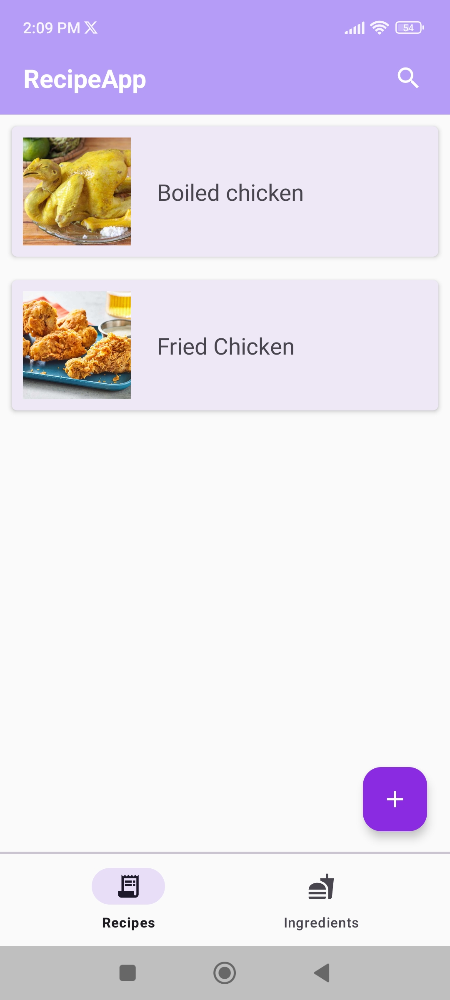
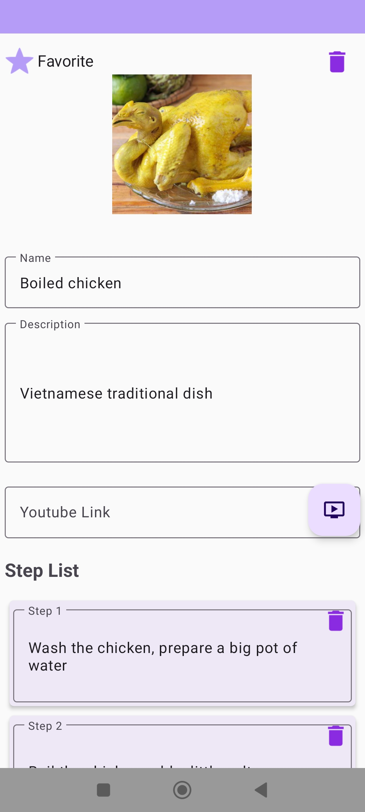
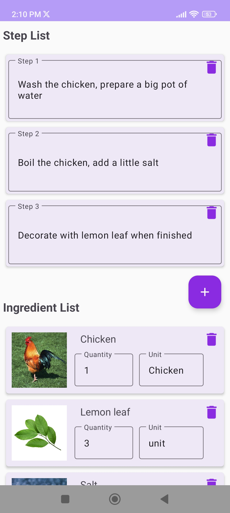
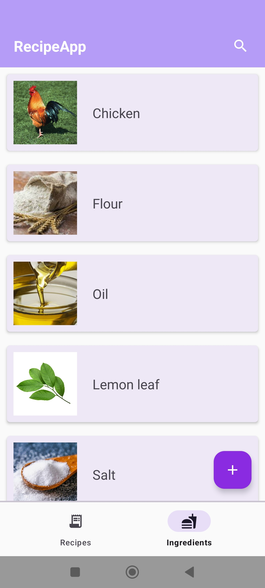
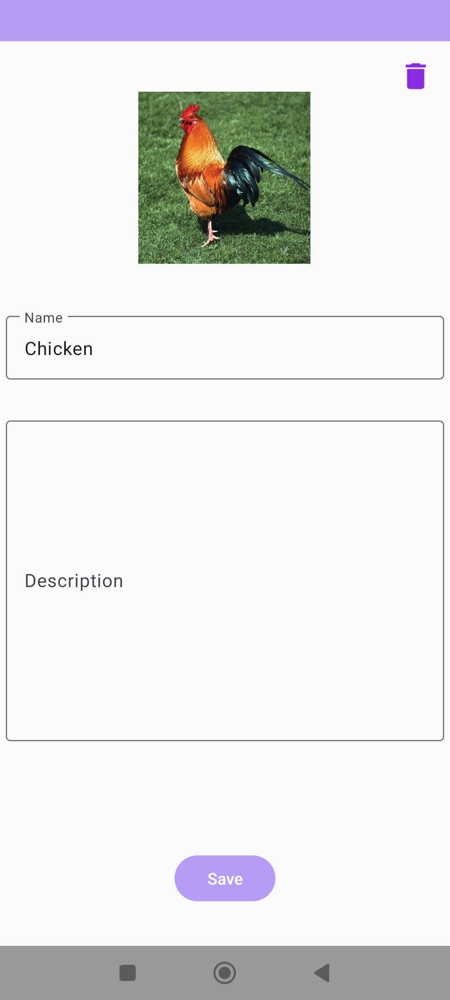
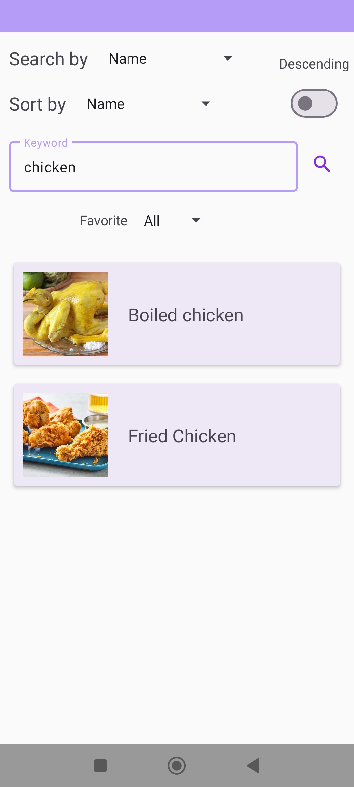
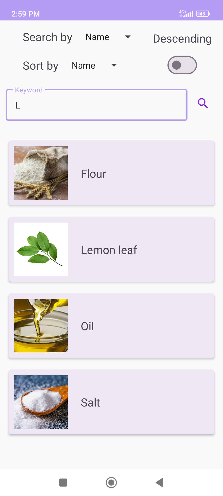

# Introduction

This is a small android app that used these following technologies:

- Dagger-Hilt (Dependency Injection)
- MVVM architecture
- Room Database
- Coroutine

# Features

## Recipe

### View all recipes

### Update, Delete recipe

### View, Add, Update, Delete ingredient list, step list

## Ingredient

### View all ingredient

### Add, Update, Delete ingredient

## Search

### Search recipes by name, date range

### Search ingredients by name

